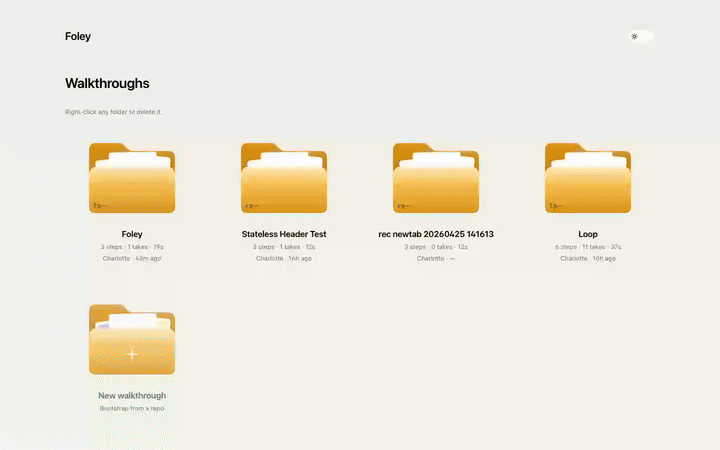

# Foley

**Product walkthrough videos that maintain themselves from PRs.**

[](LICENSE)
[](apps/cutroom)
[](services/director)
[](apps/cutroom/tsconfig.json)
[](pnpm-workspace.yaml)

[](services/director/src/director/proposer.py)
[](services/director/src/director/narrator.py)
[](apps/cutroom/src/app/api/genai)
[](services/director/src/director/playwright_runner.py)
[](services/director/src/director/concat.py)

[](apps/foley-mcp)
[](skills/foley)
[](apps/cutroom/src/app/llms.txt)
[](apps/cutroom/src/app/api/oembed)



The clip above is a Foley walkthrough _of Foley_, captured by the same pipeline a user runs. ▶️ **[Watch the full tour](walkthroughs/foley/takes/master/master.mp4)** · 26 s · 1440 × 900 · voiced · [captions](walkthroughs/foley/captions.vtt).

---

## The problem

Product walkthrough videos go stale the moment they ship.

A button gets renamed. A screen gets added. A flow gets shortened. The video on your homepage now shows a UI that doesn't exist. Inside three months, every recorded demo on a fast-moving product is a lie.

The maintenance loop costs:

- A scriptwriter rewriting narration to match new copy.
- A screen recording session.
- A voice-over session (or a paid clone re-take).
- A video editor stitching the new shots into the old timeline.
- A reviewer making sure the cut still flows.
- A re-publish.

That's a half-day round-trip per change, every time the product moves. So teams stop maintaining the videos. The videos rot. Adoption suffers because the most concrete artefact of how the product works — the walkthrough — is visibly out of date.

Today's tools don't close the loop:

| | What it does | What it doesn't do |
|---|---|---|
| **Mintlify** | Generates docs *text* from PRs | No video |
| **Guidde** | Polishes a human-recorded walkthrough | Each maintenance cycle is a fresh recording |
| **Loom / Tella** | Records and publishes screen captures | No diff-aware updates; every change is a re-record |
| **Arcade** | Interactive product tours | Tours, not video; still hand-edited per change |

Nobody maintains an autonomous, on-brand walkthrough _video_ end-to-end. That's the gap Foley closes.

---

## Capabilities

What Foley does today:

- **Auto-onboarding from a GitHub repo + a dev URL.** The wizard fetches your landing page's HTML, asks Claude Sonnet 4.6 to draft 3–8 grounded Playwright steps with text-locator selectors, and writes them to `walkthroughs/<slug>/walkthrough.yaml`. Empty repo → first take in under a minute.
- **PR-driven retakes.** Every pull request triggers the director agent. It diffs the change against the current walkthrough, classifies every step as unchanged / changed / added / removed, and re-runs Playwright + ElevenLabs only on the affected ones. Unchanged segments stay byte-identical across takes (provable via `director diff-takes`).
- **Resilient capture.** A bad selector flags the step amber and keeps going — the rest of the ingest still completes. Per-step **Retake** button heals it without leaving the editor.
- **One YAML, three outputs.** The same Walkthrough drives the master video, a scrollable docs page at `/docs/<id>`, and a plain-Markdown export at `/docs/<id>.md` for AI ingestion.
- **AI-readable surfaces.** `/llms.txt`, `/skill.md`, `/api/mcp`, and the Markdown export give Claude / ChatGPT / Cursor a clean ingestion path. Inline **Ask this walkthrough** widget on every doc page does Claude RAG over the transcript with click-to-jump citations. **Open in …** dropdown hands the URL to your favourite LLM in one click.
- **Continuous narration.** ElevenLabs `convert_with_timestamps` produces one continuous mp3 spanning every step + per-character alignment data. Editor playback is smooth across step boundaries; captions and the click-to-jump transcript fall out of the same timing JSON.
- **PR comment bot.** When the webhook fires and a new take is built, Foley posts back to the PR: a per-step diff table, a compare URL, and an embedded `preview.gif` of the new take.
- **Voice cloning.** Drop a 30 s – 2 min audio sample into the Brand panel; ElevenLabs Instant Voice Cloning produces a `voice_id` and the next render is in your voice.
- **SEO + sharing.** Auto sitemap.xml, robots.txt, OpenGraph, Twitter player card, oEmbed, RSS changelog feed per walkthrough. Hidden walkthroughs ship `noindex` and drop out of `/llms.txt`.
- **Pre-flight checks + friendly errors.** Missing ffmpeg, a malformed YAML, an unset API key — all surfaced as actionable banners, not stack traces.
- **`director check`.** One CLI command runs schema validation + URL link checking + a11y triage + artefact audit, with a coloured rich.Table report and a Unix exit code.

---

## Architecture

Two services connected by a shared filesystem. No DB, no queue, no auth.

```
                       ┌────────────────────┐
                       │  GitHub PR opened  │
                       └──────────┬─────────┘
                                  │ webhook
                                  ▼
   ┌──────────────────────────────────────────────────────────┐
   │                    apps/cutroom (Next.js 14)             │
   │   onboard wizard · step editor · review · publish        │
   │   /docs/<id> · /docs/<id>.md · llms.txt · skill.md       │
   │   /api/walkthroughs/<id>/{ask,captions,transcript,       │
   │                            poster,preview.gif,           │
   │                            changelog.rss,feedback}       │
   └──────────┬───────────────────────────────────────────────┘
              │ shells out to `uv run director …`
              ▼
   ┌──────────────────────────────────────────────────────────┐
   │            services/director (Python · uv)               │
   │                                                          │
   │   github ──▶ agent (Sonnet 4.6, adaptive thinking)       │
   │                  │                                       │
   │                  ▼                                       │
   │       StepDiff[] {unchanged | changed | added | removed} │
   │                  │                                       │
   │       ┌──────────┼──────────┐                            │
   │       ▼          ▼          ▼                            │
   │   playwright  narrator    concat                         │
   │     (clip)     (mp3)      (master.mp4)                   │
   │                                                          │
   │   Logfire spans wrap every stage.                        │
   └──────────┬───────────────────────────────────────────────┘
              │ writes
              ▼
        walkthroughs/<id>/takes/<take-id>/master.mp4
```

State of record is everything under `walkthroughs/<id>/`. To deploy a new instance, you `git clone` the tree; to back up, you `tar` it. To roll a take back, you swap the `master/` folder. The byte-identity property of unchanged segments makes the data plane provable.

Repo layout:

```
apps/cutroom/                       Next.js 14 — dashboard, onboard, step editor, all APIs
services/director/                  Python — agent, proposer, ask, capture, narrate, concat, check
walkthroughs/v1/                    Canonical "Loop" demo
walkthroughs/foley/                 Foley demoing Foley (rendered by the same pipeline)
scripts/bootstrap.sh                One-shot setup
scripts/test/                       7-layer smoke-test suite
extensions/recorder/                Chrome extension — alternate import path
.claude/skills/foley/               Claude Code skill that wraps `director review`
wiki/                               Detailed reference, mirrored to https://github.com/lukataylo/Foley/wiki
```

The cutroom is a thin reader; the director is the only writer (every state file goes through atomic write helpers — `write_text_atomic` / `writeFileAtomic` — so a process crash mid-write can never leave a half-written JSON for the next reader).

---

## How it works

### 0 · A new project becomes a walkthrough in 30 seconds

The first cut is _not_ hand-authored. The onboarding wizard fetches the dev URL's landing-page HTML, hands it to Claude Sonnet 4.6 with adaptive thinking, and gets back a `ProposedSteps` object — 4–7 steps with grounded Playwright actions. The proposer writes those into `walkthrough.yaml`, the user lands in the step editor, clicks **Render**, and the rest of the pipeline kicks in.

### 1 · The walkthrough is a list of step atoms

Each step has a stable id, a Playwright recipe, narration text, a captured clip, and a duration. Once a walkthrough exists you can extend it from the editor (+ Add step / drag to reorder / inline Retake) or by hand in YAML:

```yaml
- id: mark_done
  title: Move it forward
  narration: One click marks a ticket as done. No status menus, no friction.
  duration_ms: 5500
  actions:
    - { kind: goto,  url: "/ticket/LOP-103" }
    - { kind: hover, selector: "[data-testid=mark-done-button]" }
    - { kind: click, selector: "[data-testid=mark-done-button]" }
```

### 2 · The director reads every PR

When a PR opens against the watched repo, a webhook enqueues a job. The director — Claude Sonnet 4.6 with adaptive thinking — reads the unified diff and the current walkthrough and returns one verdict per step:

```
intro          unchanged  No interaction with the renamed button.
sign_in        unchanged  Sign-in flow untouched.
board_overview unchanged  Board layout and copy unchanged.
open_ticket    unchanged  Ticket page entry-point unchanged.
mark_done      changed    Button label moved from 'Mark as done' to 'Ship it';
                          the clip would be misleading and narration should
                          echo the new product voice.
settings       unchanged  Settings page unaffected.
```

The verdict is structured output — typed against Pydantic models via a forced tool call — not free text. Every step is classified; nothing is a guess.

### 3 · Only changed steps re-run

Playwright recaptures the affected steps. ElevenLabs re-narrates only the changed lines, in the same voice. ffmpeg concat-demuxes the resulting segments into a new `master.mp4`. Encode parameters are pinned, so segments for unchanged steps are **byte-identical** across takes:

```
master vs take-007
┏━━━━━━━━━━━━━━━━┳━━━━━━━━━━━┳━━━━━━━━━━━━━━━┳━━━━━━━━━━━━━━━┓
┃ step           ┃ identical ┃ master sha    ┃ take-007 sha  ┃
┡━━━━━━━━━━━━━━━━╇━━━━━━━━━━━╇━━━━━━━━━━━━━━━╇━━━━━━━━━━━━━━━┩
│ intro          │ ✓         │ 08b5f59225bd… │ 08b5f59225bd… │
│ sign_in        │ ✓         │ 78f1b33f2f47… │ 78f1b33f2f47… │
│ board_overview │ ✓         │ 52d1fb6bd323… │ 52d1fb6bd323… │
│ open_ticket    │ ✓         │ e79534946f4c… │ e79534946f4c… │
│ mark_done      │ ✗         │ aa7160101d07… │ 32f36822e383… │
│ settings       │ ✓         │ 3228f640ee9a… │ 3228f640ee9a… │
└────────────────┴───────────┴───────────────┴───────────────┘
```

Five of six segments are bit-for-bit the same as the previous master. Only the changed step has new bytes. That's the property that makes the system honest: it's not "regenerated and hopefully looks similar," it's "literally the same, except the part that changed." Foley posts the same table back to the PR as a comment.

### 4 · A human approves the take

The new take lands in the cutroom — a stripped-down review UI that shows the timeline, the diff status per step, the side-by-side compare, and a single **Approve master** button. Approving promotes the take. Rejecting marks it rejected and the cutroom moves on.

The data model is the editor.

### Vocabulary

Foley uses film vocabulary in code and UI; internalise it once and the API surface becomes predictable.

- **Walkthrough** — the product, versioned over time.
- **Step** — atomic unit: action + selector + narration + clip + duration. Stable id.
- **Take** — a versioned attempt at the master. Each PR produces a `take-NNN`.
- **Master** — the approved take that gets shipped. Subsequent takes diff against it.
- **Director** — the agent that diffs PRs and decides which steps to retake.
- **Cutroom** — the dashboard where humans review, approve, and publish.
- **Dailies** — list of takes in review.
- **Retake** — re-run a single step.
- **Brand** — voice, palette, font, pacing rules.

---

## Director CLI

Run from the repo root:

```bash
pnpm director <subcommand> …                                  # via the package.json alias
uv --directory services/director run director <sub> …         # direct
PYTHONPATH=services/director/src uv … run director <sub> …    # if the editable install is shy
```

| Command | What it does |
|---|---|
| `director propose-steps <id> [--dev-url ...] [--description ...]` | Draft 3–8 walkthrough steps from the dev URL's HTML. Writes `walkthrough.yaml`. |
| `director ingest [id] [--headed] [--force] [--skip-narration]` | Capture clip + narration for every step. Per-step failures don't abort the loop. |
| `director retake <step_id> [walkthrough_id] [--headed]` | Re-run a single step (force, ignore cache). |
| `director master [walkthrough_id] [--take <id>]` | Concat segments → `master.mp4`. Reuses byte-identical segments from a parent take. |
| `director synth-continuous [id]` | One ElevenLabs call → `narration.mp3` + `narration.timing.json` + `narration.waveform.json`. |
| `director captions [id]` | Generate `captions.vtt` from `narration.timing.json`. |
| `director bake-master [id] [--intro x.png --outro y.png]` | Add intro / outro PNG bookends with fades. |
| `director review <PR_NUMBER> [walkthrough_id] [--no-comment]` | Full PR loop: fetch diff → run agent → retake affected → assemble → post comment back to the PR. |
| `director diff-takes <a> <b> [walkthrough_id]` | Per-segment SHA-256 comparison between two takes. |
| `director ask <id> --question "…"` | RAG over a walkthrough's narration. Returns `{answer, citations: [step_id]}` as a JSON envelope on stdout. |
| `director check [id] [--no-network]` | Schema + link checker + a11y triage + artefact audit. Exit 0 / 1 / 2. |

Most commands default `walkthrough_id` to `v1`. Override by passing it positionally.

---

## Status

Hackathon project — *To The Americas*, Unicorn Mafia, London, April 2026. The first cut shipped in a 22-hour window; the current build adds the auto-onboarder, the Ask widget, the AI-readable surfaces, the smoke test suite, and the recursive Foley-of-Foley demo at the top of this README.

Single-tenant, no auth, no DB, demo-only. Production-ready is _not_ in scope:

- No auth, no rate limits, no per-user isolation.
- No CDN — every asset is served by Next.js itself.
- No queue — every render is a detached child process.
- No observability beyond Logfire spans.

If you adopt Foley for real, start there.

---

## Quickstart

```bash
git clone https://github.com/lukataylo/Foley.git
cd Foley
pnpm bootstrap        # checks ffmpeg/uv/pnpm, installs deps, copies .env.example → .env
pnpm dev              # http://localhost:3000
```

Open `http://localhost:3000/welcome` and paste your **Anthropic** + **ElevenLabs** keys into the in-page form — Foley validates them against the live providers before writing them to `.env`. A **Google API key** is optional but unlocks the "Nano Banana" (Gemini 2.5 Flash Image) clip type for laptop-mockup + stylized-transition slides in the take editor.

Click **+ New walkthrough** on the home page to onboard a project, or open the seeded **Loop** walkthrough to play a finished take. The full **Quickstart for judges** lives in the wiki.

**Right-click any walkthrough on the home grid to delete it.**

### Plug Foley into your AI editor

```bash
pnpm --filter foley-mcp build
claude mcp add foley node "$(pwd)/apps/foley-mcp/dist/index.js"
mkdir -p ~/.claude/skills && ln -s "$(pwd)/skills/foley" ~/.claude/skills/foley
```

After that, Claude Code (or any MCP-aware editor) can `list_walkthroughs`, `ask_walkthrough`, and `get_transcript` against your local cutroom — and the bundled skill teaches Claude the Foley vocabulary so it cites step ids correctly.

The smoke test suite is `bash scripts/test/all.sh` (`SKIP_AI=1` skips the layer that calls Claude).

---

## Wiki

Detailed reference: <https://github.com/lukataylo/Foley/wiki> (mirrored at `wiki/` in this repo).

- [Quickstart for judges](https://github.com/lukataylo/Foley/wiki/Quickstart-for-judges)
- [Quickstart for developers](https://github.com/lukataylo/Foley/wiki/Quickstart-for-developers)
- [Architecture](https://github.com/lukataylo/Foley/wiki/Architecture)
- [walkthrough.yaml schema](https://github.com/lukataylo/Foley/wiki/walkthrough.yaml-schema)
- [brand.yaml schema](https://github.com/lukataylo/Foley/wiki/brand.yaml-schema)
- [API reference](https://github.com/lukataylo/Foley/wiki/API-reference)
- [Director CLI reference](https://github.com/lukataylo/Foley/wiki/Director-CLI-reference)
- [AI features](https://github.com/lukataylo/Foley/wiki/AI-features)
- [Competitor parity](https://github.com/lukataylo/Foley/wiki/Competitor-parity)
- [Testing](https://github.com/lukataylo/Foley/wiki/Testing)
- [Operations & runbook](https://github.com/lukataylo/Foley/wiki/Operations-and-runbook)
