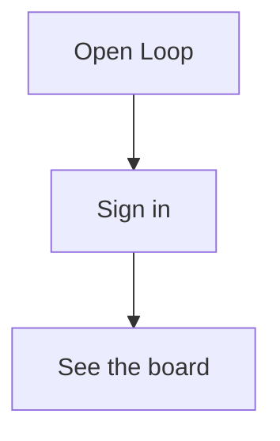

# walkthrough.yaml schema

Authoritative source: `services/director/src/director/models.py`. This page mirrors the Pydantic models in human-readable form.

## Top level

```yaml
version: 1                          # int >= 1; only 1 today
display_name: "Loop"                # optional; used in the cutroom UI
target_app:
  repo: "lukataylo/Foley-demo"      # owner/name
  dev_url: "http://localhost:3001"  # where the product is running
brand_ref: brand.yaml               # optional; resolved to a sibling brand.yaml
hidden: false                       # optional; true → omit from /, sitemap, llms.txt; ship noindex meta
steps:
  - …                               # one or more Step records (see below)
```

`extra: forbid`. Any field not listed above causes a validation error and `/walkthroughs/<id>/edit` shows a red banner with the offending key.

## Step

```yaml
- id: intro                         # snake_case, 1-64 chars, [a-z0-9_]+; STABLE across versions
  title: "Welcome to Loop"          # human-readable
  narration: "Loop is …"            # 1-2 sentences spoken over the clip
  duration_ms: 5500                 # 500 ≤ x ≤ 30000
  viewport: { width: 1440, height: 900 }   # optional; default {1440, 900}
  actions:
    - { kind: goto, url: "/" }
    - { kind: wait, ms: 4500 }
```

### Action kinds

Every action has a `kind`; other fields depend on the kind. See `models.py:Action.@model_validator` for the validation rules.

| `kind` | Required fields | Notes |
|---|---|---|
| `goto` | `url` | Relative paths resolved against `target_app.dev_url`. |
| `click` | `selector` | Playwright text-locator preferred (e.g. `text="Sign in"`). 8 s timeout. |
| `fill` | `selector`, `value` | 8 s timeout. |
| `hover` | `selector` | 8 s timeout. |
| `wait` | `ms` | 0 ≤ ms ≤ 30000. |
| `scroll` | `ms` (optional) | If `selector` set, scrolls element into view; otherwise wheels by `ms` px. |
| `press` | `value` | Key name (e.g. "Enter", "Escape"). |

### Resilience contract

If an action fails (selector miss, timeout), the step still produces a clip — the action is recorded in `steps/<id>.meta.json:action_warnings[]` and the editor shows an amber dot. A goto failure to an unreachable dev URL records `meta.error` and a red dot.

## Narration markup

`step.narration` is rendered as plain prose by default. Two opt-in primitives:

```markdown
> [!NOTE]
> The board collapses below 720 px wide.
```

Renders as a coloured **callout** (NOTE / TIP / WARNING / IMPORTANT — colour-coded blue / green / amber / red).

````markdown

````

Renders as a **mermaid diagram**. The client lazy-loads `mermaid@10` from a CDN only on pages that contain a fenced block.

Both markup forms travel through the markdown export at `/docs/<id>.md` unchanged so AI tools see the same source you wrote.

## Hidden walkthroughs

Set `hidden: true` to:

- Omit the walkthrough from the home folder grid.
- Drop its URLs from `/sitemap.xml` and `/llms.txt`.
- Ship `<meta name="robots" content="noindex,nofollow,nocache">` on `/docs/<id>`.

The walkthrough is still accessible if you know the URL. This is a "private to URL holders" primitive — _not_ authentication. Use it for internal docs, not for secrets.
